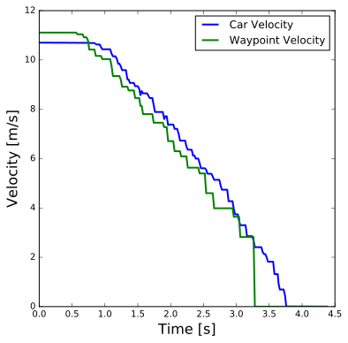
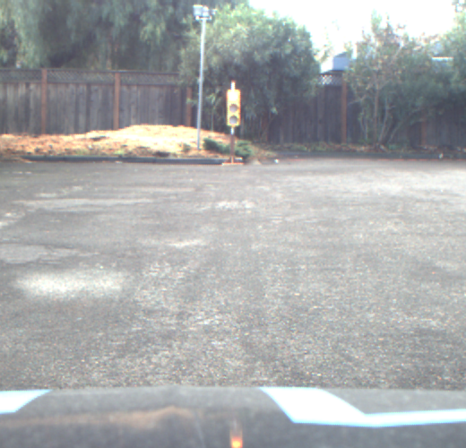
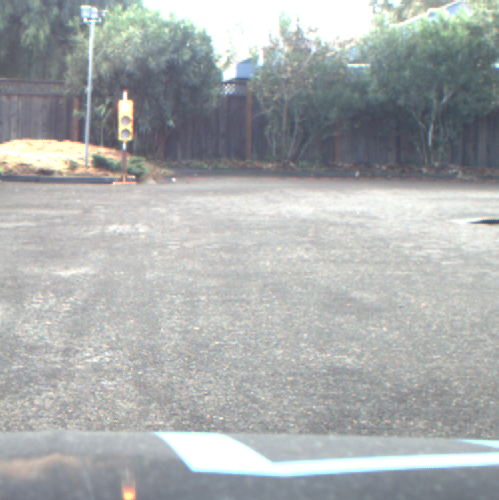
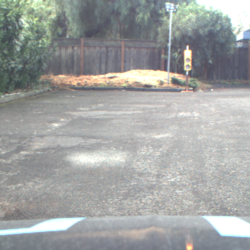
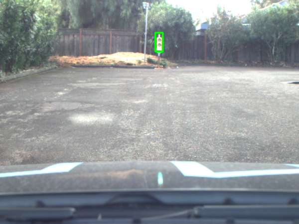
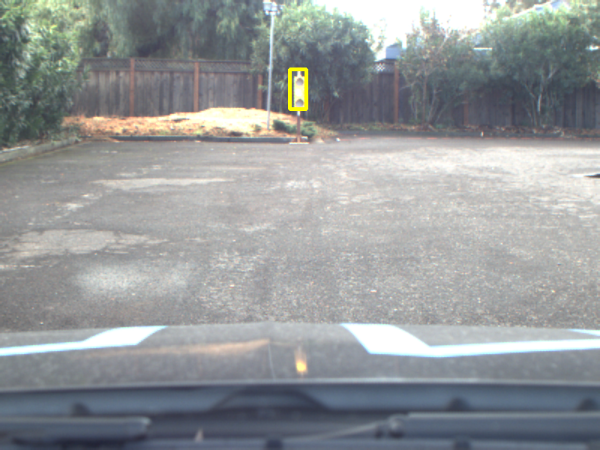
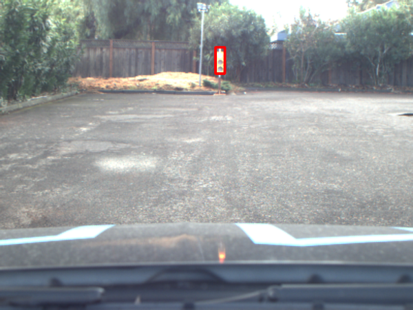
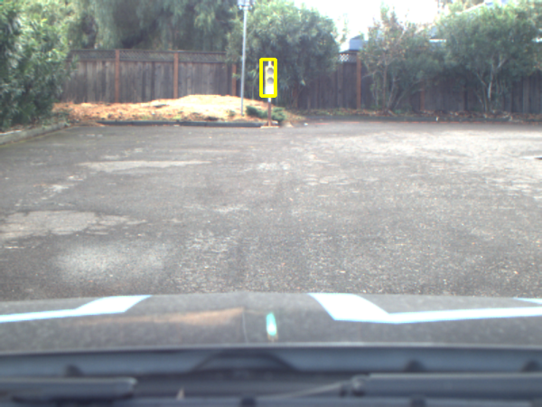

# Self Driving Car Nanodegree Capstone Project
This is the project repo for the final project of the Udacity Self-Driving Car Nanodegree: Programming a Real Self-Driving Car.

## Installation

Please use **one** of the two installation options, either native **or** docker installation.

### Native Installation

* Be sure that your workstation is running Ubuntu 16.04 Xenial Xerus or Ubuntu 14.04 Trusty Tahir. [Ubuntu downloads can be found here](https://www.ubuntu.com/download/desktop).
* If using a Virtual Machine to install Ubuntu, use the following configuration as minimum:
  * 2 CPU
  * 2 GB system memory
  * 25 GB of free hard drive space

  The Udacity provided virtual machine has ROS and Dataspeed DBW already installed, so you can skip the next two steps if you are using this.

* Follow these instructions to install ROS
  * [ROS Kinetic](http://wiki.ros.org/kinetic/Installation/Ubuntu) if you have Ubuntu 16.04.
  * [ROS Indigo](http://wiki.ros.org/indigo/Installation/Ubuntu) if you have Ubuntu 14.04.
* [Dataspeed DBW](https://bitbucket.org/DataspeedInc/dbw_mkz_ros)
  * Use this option to install the SDK on a workstation that already has ROS installed: [One Line SDK Install (binary)](https://bitbucket.org/DataspeedInc/dbw_mkz_ros/src/81e63fcc335d7b64139d7482017d6a97b405e250/ROS_SETUP.md?fileviewer=file-view-default)
* Download the [Udacity Simulator](https://github.com/udacity/CarND-Capstone/releases).

### Docker Installation
[Install Docker](https://docs.docker.com/engine/installation/)

Build the docker container
```bash
docker build . -t capstone
```

Run the docker file
```bash
docker run -p 4567:4567 -v $PWD:/capstone -v /tmp/log:/root/.ros/ --rm -it capstone
```

### Port Forwarding
To set up port forwarding, please refer to the [instructions from term 2](https://classroom.udacity.com/nanodegrees/nd013/parts/40f38239-66b6-46ec-ae68-03afd8a601c8/modules/0949fca6-b379-42af-a919-ee50aa304e6a/lessons/f758c44c-5e40-4e01-93b5-1a82aa4e044f/concepts/16cf4a78-4fc7-49e1-8621-3450ca938b77)

## Usage

### Simulator

1. Clone the project repository
```bash
git clone https://github.com/udacity/CarND-Capstone.git
```

2. Install python dependencies
```bash
cd CarND-Capstone
pip install -r requirements.txt
```
3. Make and run styx
```bash
cd ros
catkin_make
source devel/setup.sh
roslaunch launch/styx.launch
```
4. Run the simulator

### Real world testing
1. Download [training bag](https://s3-us-west-1.amazonaws.com/udacity-selfdrivingcar/traffic_light_bag_file.zip) that was recorded on the Udacity self-driving car.
2. Unzip the file
```bash
unzip traffic_light_bag_file.zip
```
3. Play the bag file
```bash
rosbag play -l traffic_light_bag_file/traffic_light_training.bag
```
4. Launch your project in site mode
```bash
cd CarND-Capstone/ros
roslaunch launch/site.launch
```
5. Confirm that traffic light detection works on real life images

## Main Objectives

Given
* base waypoints,
* traffic lights positions,
* car position and
* camera images

Objectives
* publish a list of waypoints for the car to follow with set velocity for each waypoint (`ros/src/waypoint_updater/waypoint_updater.py`)
* publish brake/throttle/steer commands for the drive by wire module (`ros/src/twist_controller/dbw_node.py` and `ros/src/twist_controller/twist_controller.py`)
* classify traffic lights given raw image pixels (if a traffic light is in range of the car) and make appropriate adjustments to waypoint velocities (e.g. velocity goes to zero for red light, or increase velocity if the light goes from red to green) (`ros/src/tl_detector/tl_detector.py` and `ros/src/tl_detector/light_classification/tl_classifier.py`)

## Waypoint Publishing

For publishing the waypoints for the car to follow, I find the nearest waypoint to the car from the base waypoints and then take the next `200` base waypoints. If there is a traffic light waypoint index published on the channel `/traffic_waypoint`, I compute the velocities for the waypoints that lead to the traffic light, such that the car stops with a constant coefficient of deceleration. These velocities are written in newly created waypoints that are then published to the `/final_waypoints` channel. Alternatively, one can simply modify the base waypoints, but then the velocity must be set on each step of the algorithm, regardless if there is a traffic light or not. On the one hand using this approach, there are no memory allocations for the new waypoints and also we pay a fixed cost for setting the velocities each time rather than higher cost than usual when there is a traffic light. On the other hand, we modify the base waypoints which are published only once and hence there is only one copy (barring keeping a copy of the whole waypoint array in a backup variable).

To compute the waypoint velocities in the presence of a traffic light I use the following formula

<code>v = sqrt(-2sa<sub>0</sub>)</code>

where `s` is the distance of the waypoint to the stopping line and <code>a<sub>0</sub></code> is the constant deceleration. To derive this formula note

<code>a(t) = a<sub>0</sub></code>

and thus after integration
<code>v(t) = a<sub>0</sub>\*t+v<sub>0</sub></code>

where <code>v<sub>0</sub></code> is the initial velocity (this is easy to see since <code>v(0) = v<sub>0</sub></code>). But we also know that at some time `T` when the car is at the stop line, the velocity is `0`

<code>v(T) = a<sub>0</sub>\*T+v<sub>0</sub> = 0</code>

or

<code>T = -v<sub>0</sub>/a<sub>0</sub></code>

After integrating `v(t)` we can also get the distance travelled `s(t)` (or in our case -- the distance between the waypoint and the stop line of the traffic light) as

<code>s(t) = a<sub>0</sub>\*t<sup>2</sup>/2 + v<sub>0</sub>\*t + s<sub>0</sub></code>

From `s(0)=0` we determine that <code>s<sub>0</sub>=0</code>. If we now compute `s(T)` and substitude <code>T = -v<sub>0</sub>/a<sub>0</sub></code> we get (after simplification)

<code>s(T) = -v<sub>0</sub><sup>2</sup>/(2\*a<sub>0</sub>)</code> or finally
<code>v<sub>0</sub> = sqrt(-2s(T)a<sub>0</sub>)</code>

The specific value I chose is <code>a<sub>0</sub>=-3m/s<sup>2</sup></code>. Given this value and the above formula for the velocity, this is a plot of the actual car and waypoint velocities (in blue and green, respectively) with respect to time just before a traffic light.



As can be observed from the blue line, the velocity looks almost linear. In total it decreases by about <code>3.4m/s<sup>2</sup></code> on average.

One can also use for example a linear relationship between the velocity and distance travelled, i.e. <code>v(t) = v<sub>0</sub>-ks(t)</code> which would lead to a velocity with exponential decay in time.

Some of the other things that I have tried are
* using the python standard library `copy.deepcopy` for the creation of the final waypoints when there is a traffic light and then modifying their velocities, but for some reason these waypoints came out bugged
* using the linear relationship between velocity and distance, but the linear in time velocity (i.e. with constant acceleration) gave me better results
* when determining whether the nearest waypoint to the car is behind the vehicle and hence we should use the next waypoint, I initially used to check the difference in angles between the orientation of the car and the vector between the car coordinates and the nearest waypoint. In some instances this criterion gave incosistent results (although the car did not seem to have trouble navigating the course in the simulator). I switched to checking the sign of the scalar product of the vectors `v1 = car_pos-nearest_wp_pos` and `v2 = next_wp_pos-nearest_wp_pos`. If the scalar product is positive (meaning that the two vectors point in the same direction), I choose the next waypoint.
* when calculating the distances for the velocity formula I initially used the provided `distance` method, but since this results in an O(n<sup>2</sup>) calculations on the `final_waypoints`, I wrote the `get_relative_distances` method that computes all waypoint distances to the traffic light only once, resulting in O(n) calculations

## Drive by Wire and control

To control the car I first read the expected linear and angular velocities from the `Twist` command published by the `waypoint_follower` node. These (along with the current car velocity) are then passed on to the controller object implemented in `twist_controller.py`. The current velocity is filtered using the low pass filter from `lowpass.py` with values `tau=0.5,ts=0.2`. The throttle is a real value in `[0,1]`. To control it, I use a PID controller with `P` coefficient `0.5`, `I` and `D` coefficients set to `0` and output values clamped between `0` and `1`. To prevent high values at low speeds (especially when the car is at `0 m/s`), I limit the growth of the throttle to `0.002` between time steps.

The brake command is given as torque in units of `N*m` (Newton meters). It is calculated as the desired acceleration (<code>m/s<sup>2</sup></code>) times the vehicle mass (`kg`) times the wheel radius (`m`). The mass and radius are given as external parameters. The acceleration is chosen as the smaller (in absolute values) between the maximum allowed deceleration (also external parameter) and the difference between the desired velocity and current velocity. If the waypoint velocity is `0` and the current speed is below `1 m/s`, I set the brake to `400 Nm` and the throttle to `0`.

The steering is calculated using the code provided in `yaw_controller.py`.

I also tried further smoothing of the current velocity with the low pass filter. This filter is essentially calculating a running mean, i.e. <code>v<sub>filtered</sub>(t<sub>N</sub>) = a\*v<sub>filtered</sub>(t<sub>N-1</sub>) + (1-a)\*v<sub>measured</sub>(t<sub>N</sub>)</code>. Higher ratios between `tau` and `ts` give bigger weight to the first term and hence smaller impact of the current measurement of the velocity. This is problematic for example when the car is stopping at a traffic light and the filtered velocity becomes much higher than the current velocity leading to high braking torque and a premature stopping of the vehicle.

Another thing I tried is to also use the `I` and `D` terms of the `PID` controller. However, using only the `P` component, with manual control of throttle growth, actually led to better results with faster convergence to steady state.

## Traffic Light Detection

To detect traffic lights, after receiving an image, I first find the nearest traffic light to the car. If the distance between the car and the traffic light is below 80m, I send the image data to the image classifier.
I approached the object detection itself in two ways. For the simulator a simpler and more efficient approach is to use pixel counting to determine the color of the traffic light. However, this does not generalize well to the color rich real world data. For a more general solution applicable to both the simulator and real world imagery, I trained a neural network classifier.

### Pixel Counting

This method relies on the fact that there are not a lot of colors in the simulator. Upon investigation in an image editor, I determined that the following code gives robust detection of the traffic light color
```python
bool_img = (image[:,:,2] >= 200) & (image[:,:,1] <= 70)
if np.sum(bool_img) >= 27:
    return TrafficLight.RED
bool_img = (image[:,:,1] >= 235) & (image[:,:,2] <= 120)
if np.sum(bool_img) >= 30:
    return TrafficLight.GREEN
image = cv2.cvtColor(image, cv2.COLOR_BGR2HSV)
bool_img = (image[:,:,0] >= 28) & (image[:,:,0] <= 32) & (image[:,:,2] >= 240)
if np.sum(bool_img) >= 40:
    return TrafficLight.YELLOW
return TrafficLight.UNKNOWN
```
where `image` is a `BGR` encoded image.

### Neural network classification

For the neural network training I used the [Tensorflow Object Detection API](https://github.com/tensorflow/models/tree/master/research/object_detection).

#### Dataset and preparation

I trained the network on the [Bosch Small Traffic Lights Dataset](https://hci.iwr.uni-heidelberg.de/node/6132).
The base object detection models that I use, first resize all images to 300x300 pixels.
To improve the training of the classifier, I only consider traffict lights that will not become only a couple of pixels after resizing.
Specifically, I do the following. From the base images, I only extract square patches that contain a traffict light that is at least 15px wide.
If there is only one traffic light in the image, I extract a 500x500 patch centered on the light.
If there are two or more traffic lights in the image, I extract a patch that captures all lights and a buffer of 10 pixels around them, so that they are not at the very edge of the image patch.
After this process, I had 1026 training images and 1830 evaluation images.

After initially training only on the Bosch Dataset, I realized that the traffic light in the camera images from the training rosbag provided by Udacity was not consistent with the Bosch Dataset images.
On most frames, the traffic light looks only bright yellow/white, regardless of whether the red/yellow/green lamp is on.
As expected, the classification results were poor.
To improve them I used a [script from ros.org](http://wiki.ros.org/rosbag/Tutorials/Exporting%20image%20and%20video%20data) to extract the camera data (image frames) from the rosbag.
I then used [LabelImg](https://github.com/tzutalin/labelImg) to label an additional 336 images by hand in the different states of the traffic light.
Similar to the Bosch Dataset, I extract 500x500 patches around the traffic light.
However, if the traffic light is relatively in the center of the image, I additionally extract crops, where the light is on the left or on the right side of the image patch.
This allowed me to generate 802 additional training images. This is an example of a row frame and the resulting 3 training images.






No training images were collected from the simulator.

#### Training process and results

An important consideration in the current use case is that an autonomous vehicle needs real-time detection. Thus, we need fast models. I used two base models from the [Tensorflow detection model zoo](https://github.com/tensorflow/models/blob/master/research/object_detection/g3doc/detection_model_zoo.md) -- the two SSD models `ssd_mobilenet_v1_coco` and `ssd_mobilenet_v2_coco`. I trained the first model on TensorFlow 1.3 and the second on TensorFlow 1.7. As an output both of them return bounding boxes around detected objects, as well as predicted class and confidence of prediction for each object.

The evaluation metric that the object detection API uses is mAP@0.5IOU. That means that the mean average precision of the classification is calculated when the Intersection of the area between predicted and real object is at least 50% of the area of their Union. The `v1` model achieves about 95% mAP, whereas the `v2` model achieves about 98% mAP.

I will first explain the inference procedures that I use, and then I will give the reasoning for them.

For inference I supply five images to the classifier that are all resized to 300x300. The first is the whole image, but I additionally supply four more patches of 500x500 pixel sizes that are located in each corner of the 800x600 input image. The returned predictions are filtered with respect to the confidence of prediction and based on the ratio of the boxes themselves. Boxes that have ratios incompatible with a traffic light are rejected, to minimize detections of only parts of the traffic light. The procedure then diverges slighly between the two models.

For model `v1` the prediction with the highest confidence is then chosen as the correct class. If no predictions are left after the filtering, I return Unknown state.

For model `v2` I extract from the image the largest of the remaining boxes based on area. I partition the extracted box into three parts vertically that (if detected correctly) should correspond to the red/yellow/green sections of the traffic light. I then check where the number of bright pixels (with RGB values > 230) is highest and choose this as the correct class. This approach works well for the lot traffic light that is on ground level. For the simulator, when there is a sky background, the detected box includes part of the sky and the traffic light is relatively far away, such that the sky pixels outnumber the light section pixels, a false prediction can be calculated. Other than this situation (i.e. there is no bright background or the detected box includes only the traffic light or the car is near enough the traffic light such that the section pixels outnubmer the background pixels), this approach also works well in the simulator.

I use five patches as the more data I give the classifier the higher the detection rates. Upon reflection, it might have been better to use one of the more precise models from the detection zoo, that are still relatively cheap in inference time, if only a single image would have been enough but this needs further investigation to prove.
The reason for the different approaches is that after running the two classifiers on all 2016 images that I extracted from the Udacity supplied training bag (not only on the 336 labeled ones) and looking at the results, I realized that the `v1` model gives precise class predictions but bad bounding boxes whereas the converse is true for the `v2` model. When counting by hand (as I have not labeled all 2016 images), there was about 10-15 mispredictions for `v2` and about 20-30 mispredictions for `v1` out of over 1400 total frames with a traffic light. For model `v1` in the simulator, I observed that `red` and `green` lights are detected reliably from about 90m, whereas for `yellow` light this distance is about 65-70m. The detection takes about 40ms on my system that has an Nvidia GeForce GTX 1060 6GB GPU.

Here are some examples of succeful classification on the lot frames using the `v1` model





And here is an example of a green light classified as yellow



To use the neural network models on line `51` in `ros/src/tl_detector/tl_detector.py` the parameter `use_nn` must be set to `True`. To use the `v2` model TensorFlow 1.7 or newer must be installed and the parameter `tf13` must be set to `False`. Note that the `v2` model is included for completeness, since I trained it anyway, but the main model to be evaluated is `v1` since the Udacity car only has TensorFlow 1.3 installed.
